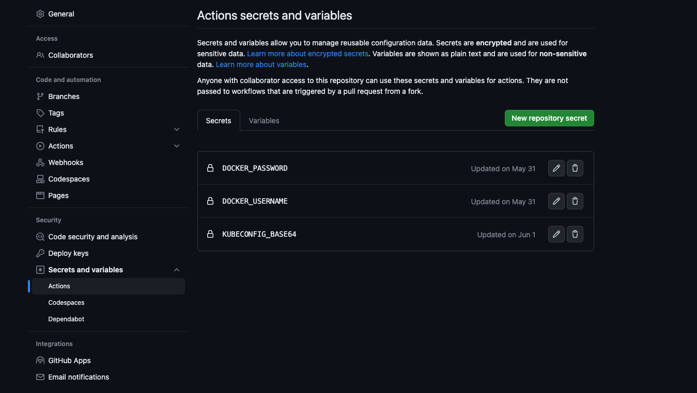

# Description English:
## Simple Pipeline
* Simple pipeline example for demonstration purposes

## Prerequisites
* Docker Hub Registry or another registry to store or retrieve the built container image
* I have deployed an AKS cluster in Azure
* The AKS Cluster Config has been converted to BASE64 format (for more information, see below)

## Pipeline Procedure
* First, a Docker image is built
* Docker Image is stored in a Docker Hub Registry
* The new Docker image is deployed on an Azure Kubernetes Service Cluster

## Variables that need to be set:
* Within the repo -> Settings -> Security / Secrets and variables -> Actions -> "Secrets" Tab
* I have set three variables for my use case:
  * DOCKER_PASSWORD
  * DOCKER_USERNAME
  * KUBECONFIG_BASE64
  
  

## A few CLI commands that can be helpful during the demo:
* watch -n 1 "kubectl get pods -o wide"
* kubectl get deployment
* kubectl delete deployment webapp-deployment
* kubectl get services

## Use AKS Cluster Kubeconfig text converted to base64 as a variable in Github:
* Command to read the AKS kubeconfig file in Azure and then download locally:
  * ``` az aks get-credentials --resource-group <rg-name> --name <aks-name> --file kubeconfig-aks ```
* Encode the local Kubeconfig File in Base64 and copy to the clipboard:
  * ``` cat kubeconfig-aks | base64 | pbcopy ```
* Transfer the content from the clipboard to Github Secrets as described above.

# How to demo:
* modify the index.html - Just change the version from v1 to v2 for example
* save the changes and push the changes to your repo
* the pipeline will betriggered
  * the pipeline build a new version of the container
  * uploads the new image to the registry
  * the pipeline deploys the new version of the containter image in your aks cluster
  * you can show the termination and redeploying of the container by the cli watch command: ``` watch -n 1 "kubectl get pods -o wide" ```

## In case you just deployed a fresh AKS cluster:
* Download the kubeconfig file
* Map the new AKS cnfig to kubectl (example): ``` export KUBECONFIG=/Users/awesomeuser/folder/kubeconfig-aks ```
* check if you can check status etc. (example):
  * ``` kubectl get nodes ```
  * To get the public IP of the LoadBalancer for accessing the index.html ``` kubectl get services ```


